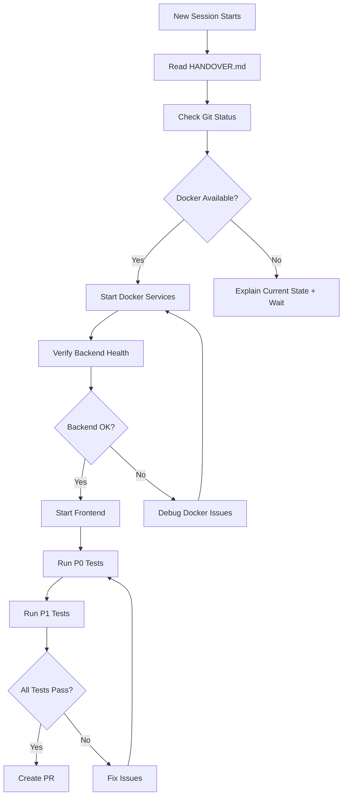

# 🚀 New Session Startup Prompt

Copy and paste this prompt when starting a new Claude Code session to continue work on this project.

---

## Prompt to Copy

```
I'm continuing work on the job board platform.

**Project Context:**
- Repository: jobboard-spec-suite
- Branch: claude/continue-job-board-frontend-011CUY4BY317qSHYg9DrSGXQ
- Previous session completed: Docker fixes, rate limiting improvements, API integration fixes
- All changes are committed and pushed

**What was completed:**
1. ✅ Created comprehensive seed data (10 jobs, 4 companies, 5 users)
2. ✅ Fixed Docker startup issues (OpenSSL + simplified entrypoint)
3. ✅ Fixed rate limiting (increased to 100 req/min for development)
4. ✅ Fixed API response structure alignment (data.data)
5. ✅ Fixed Next.js image configuration for external URLs
6. ✅ All TypeScript compilation errors resolved
7. ✅ P0 and P1 features implemented (search, bookmark, share, filters, SEO)

**What needs to be done:**
The code is ready but hasn't been tested in a Docker environment yet. I need help with:

1. **IMMEDIATE PRIORITY:** Verify Docker backend starts successfully
   - Previous session fixed entrypoint script and OpenSSL compatibility
   - Need to confirm: No "Database is unavailable" loops
   - Need to confirm: No libssl.so.1.1 errors
   - Health check should return: {"status":"ok"}

2. **Test P0 Features:** Search, Bookmark, Share functionality
3. **Test P1 Features:** Advanced filters (location, remote, employment type) and SEO
4. **Monitor:** Ensure no 429 rate limit errors during testing
5. **Consider:** Create PR if all tests pass

**Instructions:**
Please read the HANDOVER.md file first - it contains:
- Complete context of what was done
- Detailed test procedures
- Test credentials for seed data users
- Debugging guides
- Quick reference commands

Start by checking the current git status and reading HANDOVER.md.
```

---

## Alternative: Short Version

If you need a quicker startup, use this shorter version:

```
Continue job board platform work. Branch: claude/continue-job-board-frontend-011CUY4BY317qSHYg9DrSGXQ

Previous session: Fixed Docker startup, rate limiting (10→100 req/min), API response structure, and image config. All committed and pushed.

Next: Test Docker backend startup (main priority), then test P0/P1 features.

Please read HANDOVER.md for full context and test procedures.
```

---

## Environment Note

If you're on **Windows PowerShell**, use these commands:
```powershell
cd C:\SpecCoding\jobboard-spec-suite
git status
git pull origin claude/continue-job-board-frontend-011CUY4BY317qSHYg9DrSGXQ
```

If you're on **Linux/Mac**, use these commands:
```bash
cd /path/to/jobboard-spec-suite
git status
git pull origin claude/continue-job-board-frontend-011CUY4BY317qSHYg9DrSGXQ
```

---

## What Claude Should Do First

When starting a new session, Claude should:

1. ✅ Read `HANDOVER.md` (comprehensive context)
2. ✅ Read `STATUS.md` (current state summary)
3. ✅ Check git status and recent commits
4. ✅ Verify all changes are committed and pushed
5. 🚀 Begin Docker testing according to HANDOVER.md instructions

---

## Expected Workflow in New Session



---

## Key Files to Reference

When starting new session, these files contain critical information:

| File | Purpose | Read Priority |
|------|---------|---------------|
| `HANDOVER.md` | Complete context and instructions | 🔴 MUST READ |
| `STATUS.md` | Current project status | 🟡 RECOMMENDED |
| `docker-compose.yml` | Service configuration | 🟢 REFERENCE |
| `prisma/seed.ts` | Test data details | 🟢 REFERENCE |
| `.env.example` | Environment variables | 🟢 REFERENCE |

---

## Success Indicators

When new session starts successfully, you should see:

✅ Claude reads HANDOVER.md
✅ Claude checks git status
✅ Claude verifies branch is correct
✅ Claude explains current state clearly
✅ Claude starts with Docker testing (if available)
✅ Claude follows the test checklist from HANDOVER.md

---

## Troubleshooting New Session

### If Claude seems confused:
- Point Claude to HANDOVER.md
- Emphasize: "All code is done, just needs Docker testing"
- Share the test checklist from HANDOVER.md

### If Claude wants to rewrite code:
- Remind: "All fixes are completed and committed"
- Ask Claude to verify: `git log --oneline -10`
- Direct to STATUS.md for verification results

### If Docker isn't available:
- Claude should explain current state
- Claude should wait for Docker environment
- Claude can review code but shouldn't make changes

---

**Generated:** 2025-10-27
**For Branch:** `claude/continue-job-board-frontend-011CUY4BY317qSHYg9DrSGXQ`
